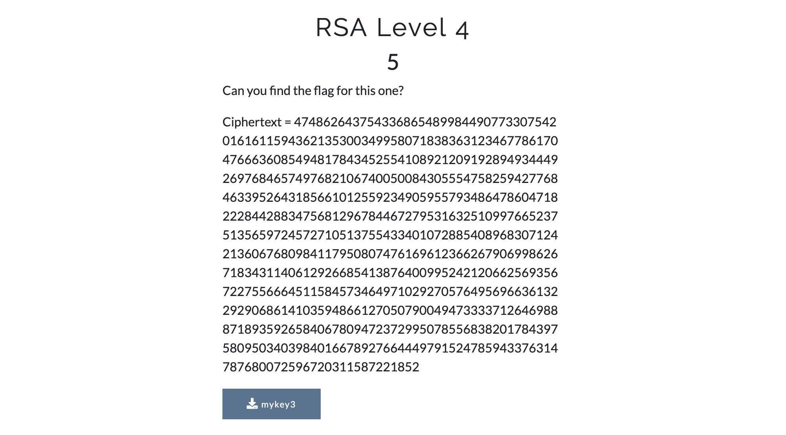

## RSA Challenges

Complete the challenges on https://zerodays.ctfd.io and give some detail on each solution.

## Solutions

### Background

These challenges test a person's understanding of the RSA cryptosystem. The letters RSA stand for Rivest–Shamir–Adleman, the authors of the encryption scheme. One of its key features is that it is an assymetric, public key cryptosystem. It has two keys, a public and a private key, where only one of them can decrypt a message encrypted by the other.

### Level 1


We need to encrypt the message `RSA isn't really that hard` and produce the ciphertext as a decimal number. To do this, we must first understand the encryption and decryption processes.

#### RSA Encryption

Given a modulus **n** and a public exponent **e**, to encrypt a message **m**:

`c = m pow e mod n`

Where `c` is the resulting ciphertext, `pow` is exponentiation, and `mod` is modulo.

#### RSA Decryption

Given a modulus **n** and a private exponent **d**, to decrypt a ciphertext **c**:

`m = c pow d mod n`

With this knowledge, all that is left is to convert the given message into a number and encrypt it. The script for the first challenge (solve1.py) does exactly that.

It uses the `binascii` module to convert the message into a hexadecimal string, which is then converted to decimal. Then `pow()` takes the number of the message, raises it to the power of `e` and does modulo `n` to produce the ciphertext value in decimal form.

Result: `13309476856206179288137278795001286676504235122200291222905951541015281640474228799375180129564959032261555135231635439690367282451635413048574322588643043250005501837597608399627442074603517951858976430767446724730937928672932493206869274420288717036712376949408229648116702610597844919828482630797157003777363091998366855062763360538948110895070725322039940644906900772757193759215740687066380017485804644723367158972689710477927318380335919282326398046586751715463059075476044138690978986063001880735783893361380726584661054926968590764176030209214513123458853087059980258593405395678238799024217478961749328706800`

---

### Level 2


The task is to decrypt the given ciphertext using the values from the first challenge. We know that decryption can be done using `d` and `n`, which are all present. The script for this challenge takes the value of `c` and raises it to the power of `d` modulo `n` which finally decodes to a message.

Result: `ZD{Well Done you have decrypted correctly}`

### Level 3


This level requires parsing a private RSA key file. Private keys are usually stored as a Base64 encoded ASN.1 sequence of values. ASN.1 stands for Abstract Syntax Notation One and is a widespread interface description language that stores data structures in a very accessible and cross-platform way.

The following command will print the values in the private key:

`openssl asn1parse -in mykey2 -i`

The output is rather large, so I stored it in a comment at the top of the solution script. The [RSA Specifications Version 2.1 (RFC 3447)](https://tools.ietf.org/html/rfc3447#appendix-A.1.2) explains how and in which order to interpret the values. Here is an excerpt:

```text
RSAPrivateKey ::= SEQUENCE {
  version           Version,
  modulus           INTEGER,  -- n
  publicExponent    INTEGER,  -- e
  privateExponent   INTEGER,  -- d
  prime1            INTEGER,  -- p
  prime2            INTEGER,  -- q
  exponent1         INTEGER,  -- d mod (p-1)
  exponent2         INTEGER,  -- d mod (q-1)
  coefficient       INTEGER,  -- (inverse of q) mod p
  otherPrimeInfos   OtherPrimeInfos OPTIONAL
}
```

The solution script uses the values obtained and prints them in the required format.

Result: `ZD{25804750360904248224329381618104859031736073222395248860499133051128513648896523325052435992237099000924849024564826844234697029915822571039994777064514824635243492963301478168480948385273501322600327794162141312212647635059765199895820389754402745012084674140342116327728380193544092902468871988407101113210818201750378837933282937750636399588218292079918162950294282004250547116764896324653457065316101365613347914317959505469586731762453963212022535424803572822031093301253062385003468990260150084465026582297271243286096414015105084255301102689693963566336024015793743350044649378818363190804537712326729609503119,65537,25564173244610971210351548452585197331194535758994673657884351015114666175874020376311922413781312689534869581593541780807512387877301314484073132668426835287971970400465565582293880630212968962130535153634911375813942663745522611172864711921423815900248860235223648392420965446176110834882493594752879241898541637225074107295433979711279703743206408857411263301020537809364614125840424406332180800207630227259634428188684178985515460114123914453650465520564263249152086786817100938246123146166512963816583276055667323176816331368813221646162976565638562106256552057858358804329568634212548081342870432443412497223185}`

### Level 4



Now we have to decrypt a message using a private key. Just like in Level 3, the first thing to do is to run:

`openssl asn1parse -in mykey3 -i`

Grabbing the needed values for decryption - `d` and `n` - along with our ciphertext, we can obtain the plaintext using the same procedure as in Level 2, which is what the solution script does.

Result: `ZD{OK time to move onto some harder stuff}`

### Level 5


Here we are given a file with some values, but `e` and `d` are missing. [The Wikipedia page for RSA](https://en.wikipedia.org/wiki/RSA_(cryptosystem)#Using_the_Chinese_remainder_algorithm) explains how to retrieve a message in this scenario, with the help of the Chinese remainder algorithm.

The solution script follows the steps described in that section. Usually `m1` and `m2` are not the same, but in this case they were and so they both stored the message `m`.

This method of RSA decryption, although unorthodox, is used by many popular cryptographic libraries (such as OpenSSL) mainly for efficiency.

Result: `Those extra private key values are meant to make it easier?`

### Level 6


The values provided are `e`, `p`, `q` and `c`, and we must get `m`.

We know that for decryption we must have `d` and `n`. Luckily, the given file contains all the necessary information to construct those two values.

We can create `n` by multiplying its prime factors `p` and `q`. And we can make `d` by taking the modular inverse of `e`, and a common multiple of `p-1` and `q-1` which is most easily obtained by multiplying the two.

Once we have `d` and `n`, we can just repeat the steps from Level 2 to get the plaintext message. The script employs the use of the `gmpy2` module for help with finding the modular inverse.

Result: `You are doing very well, you must be starting to understand RSA by now!`

### Level 7


For this level we are only given the public key. Parsing it reveals two values - `n` and `e`. Normally this isn't enough to decrypt a ciphertext, but weakly generated keys can have flaws.

RSA relies on the strength of the modulus `n` in that, ideally, its prime factors `p` and `q` (or more, in rare cases) should be very large and chosen completely at random, with no possible way of predicting them. Without this being true, the whole system falls apart.

One way of testing the strength of a key is to check if its modulus has been factorised before. If it has, then it's trivial to recover the corresponding private key.

A great resource for this is [factordb](http://factordb.com), which successfully returned a result after I tested the modulus from this level. One of the factors was 3133337 which is incredibly small for a 2070 bit modulus.

Knowing `p` and `q`, we can now repeat the steps from Level 6 and decrypt `c`.

Result: `Only 4 more challenges to go!`

### Level 8


We are given the same setup as in the previous level - `n`, `e` and `c`. Trying to factorise `n` on factordb didn't work, but one other thing stands out. The public exponent is tiny.

We know that to encrypt a message we simply raise it to the power of `e` and then modulo `n`, but if the message was never large enough to begin with to require a modulo (a safe assumption, based on the sizes of previous `m` values), then the ciphertext itself is `m` to the power of `e`. So calculating `m` would simply involve getting the cube root of `c`. But `c` is so large, how would we do that?

Well, I cheated... sort of. I didn't use tradition ways of working with numbers, but instead I manipulated strings and used Python's versatility to help recover the `e`'th root of a number. The function in question - `get_m()` - was born in solve9.py and made its way to solve8.py in no time.

To briefly describes its functionality, here is what it does:

1. Finds the length of the `e`'th root of a given number `c`.
2. Traverses its length, one digit at a time, incrementing each digit until the whole number (in that state) to the power of `e` is greater than `c`.
3. Decrements the number that overflowed `c` and continues with the next digit until the end.
4. If at any point the number to the power of `e` equals `c`, the number is returned.

So it is esentially a brute force with major speed-ups due to how easily Python handles type conversions. Brilliant!

Once the script finds `m`, it is decoded to produce the solution.

Result: `We always need to watch the size of our message`

### Level 9


### Level 10


### Level 11


